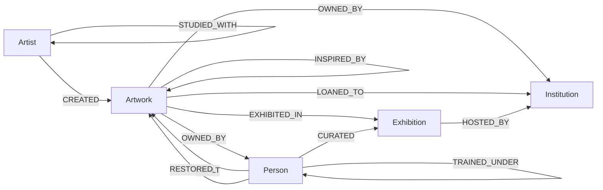
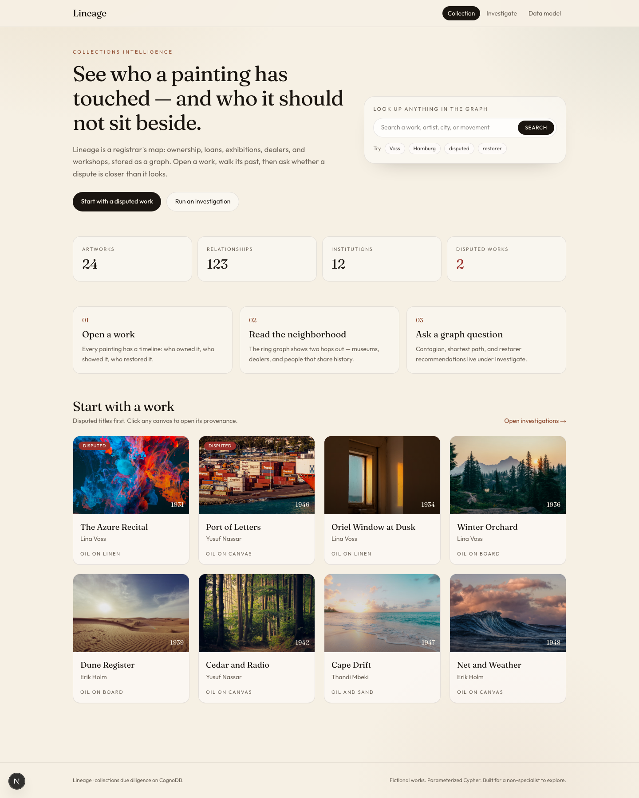
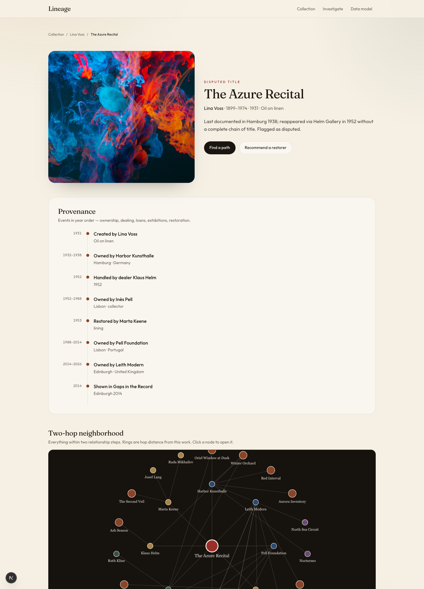
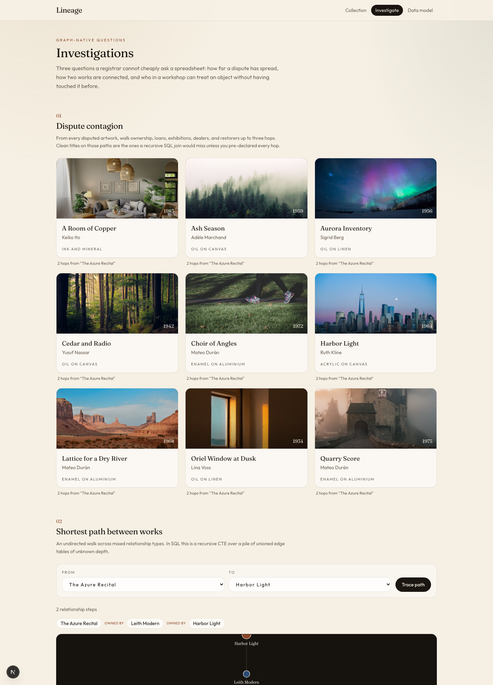

# Lineage

## Use case

Lineage is a collections-intelligence application for museum registrars, curators, and due-diligence researchers. It is backed by CognoDB.

The graph stores artworks, artists, institutions, people (dealers, restorers, collectors, curators), and exhibitions. Relationships record how those things actually connect over time: who created a work, who owned it, who it was loaned to, where it was shown, who dealt or restored it, and who trained under whom.

The product lets a non-technical user search the collection, open a work and read its provenance, see the two-hop neighborhood around it, and run three investigations: dispute contagion, shortest path between two works, and restorer recommendation through a workshop.

---

## Why a graph database?

Provenance is a path, not a row. A work does not have a single “current owner” so much as a chain — studio, dealer, collector, museum — interrupted by loans, exhibitions, restorations, and, when the paperwork fails, disputes.

The questions this application is built to answer are about those connections:

- Which otherwise clean titles sit within three hops of a disputed work, through any mix of ownership, loans, exhibitions, dealers, or restorers?
- What is the shortest path between two artworks across mixed relationship types?
- Which restorer has never treated this object, but trained in the same workshop as someone who has (or who treated a sibling work in the same collection)?

A relational schema can store the catalogue card. Answering the questions above requires recursive joins of unknown depth across several edge tables (ownership, loans, exhibitions, dealing, restoration, apprenticeship). A labelled property graph stores the same facts as typed relationships; variable-length Cypher is the query.

---

## Data model



**Nodes**

| Label | Properties |
| --- | --- |
| `Artwork` | `id`, `title`, `year`, `medium`, `palette`, `disputed`, `notes` |
| `Artist` | `id`, `name`, `born`, `died`, `nationality`, `movement` |
| `Institution` | `id`, `name`, `city`, `country`, `kind` |
| `Person` | `id`, `name`, `role`, `city` |
| `Exhibition` | `id`, `name`, `year`, `city` |

**Relationships**

| Type | Properties |
| --- | --- |
| `CREATED` | `year` |
| `OWNED_BY` | `from`, `to`, `mode` |
| `LOANED_TO` | `year` |
| `EXHIBITED_IN` | `year` |
| `HOSTED_BY` | — |
| `DEALT` | `year` |
| `RESTORED` | `year`, `treatment` |
| `TRAINED_UNDER` | `year` |
| `STUDIED_WITH` | `year` |
| `INSPIRED_BY` | — |
| `CURATED` | `year` |

---

## Setup and run

### Create the CognoDB instance

1. Go to [https://console.cognodb.com/signup](https://console.cognodb.com/signup) and create an account. The free tier does not require a credit card.
2. From the console, create a free (c0) instance and pick a region. It provisions in under a minute.
3. Save the connection details: a URI of the form `bolt+s://<instance-id>.databases.cognodb.cloud` (or the host shown in your console) and the generated password for user `cognodb`. The password is shown once — store it where the application reads secrets.

### Run the application

```bash
cp .env.example .env.local
```

Set these environment variables in `.env.local`:

```
COGNODB_URI=bolt+s://YOUR-INSTANCE.databases.cognodb.cloud
COGNODB_USER=cognodb
COGNODB_PASSWORD=your-password
```

Then:

```bash
npm install
SEED_RESET=true npm run seed
npm run dev
```

Open [http://localhost:3000](http://localhost:3000).

`SEED_RESET=true` clears the graph before loading seed data so the script can be re-run safely. Connection URI and password are read from environment variables and are never committed.

---

## Main queries

All queries are parameterized Cypher in `src/lib/queries.ts`, run through the official Neo4j driver. None concatenate user input into Cypher strings.

**Neighborhood (2+ hops).** From a work, traverse all relationship types up to two hops. This draws the ring graph on the artwork page.

```
MATCH (center {id: $id})
MATCH p = (center)-[*1..3]-(n)
WHERE length(p) <= $hops
RETURN nodes(p), relationships(p), length(p)
```

**Dispute contagion** (awkward in a relational database). From every disputed artwork, walk `OWNED_BY`, `LOANED_TO`, `EXHIBITED_IN`, `DEALT`, and `RESTORED` up to three hops and return other artworks, grouped by minimum distance. A warehouse would need a recursive CTE over several unioned edge tables of unknown depth and type.

```
MATCH (flagged:Artwork {disputed: true})
MATCH p = (flagged)-[:OWNED_BY|LOANED_TO|EXHIBITED_IN|DEALT|RESTORED*1..4]-(other:Artwork)
WHERE other.id <> flagged.id
  AND coalesce(other.disputed, false) = false
  AND length(p) <= $hops
RETURN other, min(length(p)) AS hops
```

**Shortest path between two works.** Undirected walk across mixed relationship types, ordered by path length.

```
MATCH (from:Artwork {id: $fromId}), (to:Artwork {id: $toId})
MATCH p = (from)-[:OWNED_BY|LOANED_TO|EXHIBITED_IN|CREATED|HOSTED_BY|RESTORED|DEALT|TRAINED_UNDER|STUDIED_WITH|INSPIRED_BY*1..6]-(to)
RETURN p ORDER BY length(p) LIMIT 1
```

**Workshop recommendation.** Restorers who have never treated this object, but sit one or two `TRAINED_UNDER` hops from someone who has, or from someone who treated a sibling work in the same collection.

```
MATCH path = (seed)-[:TRAINED_UNDER*1..2]-(peer:Person)
WHERE peer.role = 'restorer'
  AND NOT (peer)-[:RESTORED]->(a)
RETURN peer, min(length(path)) AS hops
```

---

## Screenshots






